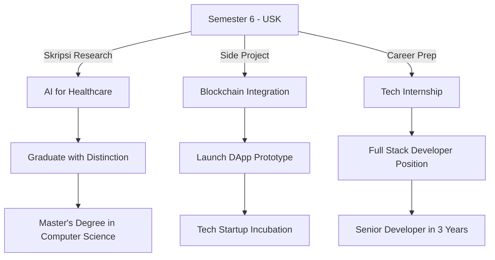

#  Hello World, I'm Rizky Yusmansyah!

  

  
  
  
  
  

## 🧐 About Me

- 🎓 **Education**: 6th semester Informatics student at **Universitas Syiah Kuala (USK)**, Aceh
- 💡 **Passionate about**: Creating innovative tech solutions that solve real problems
- 🔭 **Currently working on**: Advancing my full-stack development skills and AI integration
- 🌱 **Learning**: Blockchain Technology, Advanced DevOps practices, Microservices Architecture
- 👯 **Looking to collaborate on**: Open source projects, hackathons, and innovative tech initiatives
- ⚡ **Fun fact**: I can debug code faster with a cup of coffee ☕

## 🚀 Technical Skills

<table>
  <tr>
    <td valign="top" width="50%">
      <h3 align="center">Frontend</h3>
      
  
          
          
          
          
          
          
          
      

    </td>
    <td valign="top" width="50%">
      <h3 align="center">Backend</h3>
      
  
          
          
          
          
          
          
      

    </td>
  </tr>
  <tr>
    <td valign="top" width="50%">
      <h3 align="center">DevOps & Tools</h3>
      
  
          
          
          
          
          
          
      

    </td>
    <td valign="top" width="50%">
      <h3 align="center">Database & AI/ML</h3>
      
  
          
          
          
          
          
      

    </td>
  </tr>
</table>

## 💼 Featured Projects

  
  

  
  

## 📊 GitHub Analytics

  
  

  

  

## 🏆 Achievements

  <table>
    <tr>
      <td align="center">🥇 Finalist Hackathon Nasional 2023</td>
      <td align="center">🏅 Best Project Award - Informatics Exhibition USK 2022</td>
    </tr>
    <tr>
      <td align="center">🥉 3rd Place in National Programming Competition 2021</td>
      <td align="center">👨‍💻 Google Developer Student Club Member</td>
    </tr>
  </table>

## 📝 Latest Blog Posts
<!-- BLOG-POST-LIST:START -->
- [Membuat Aplikasi Mobile Pendeteksi Penyakit Tanaman dengan Flutter dan TensorFlow](https://medium.com/@rizkyyusmansyah/aplikasi-pendeteksi-penyakit-tanaman)
- [Menerapkan Arsitektur Microservices pada Aplikasi Web Modern](https://medium.com/@rizkyyusmansyah/microservices-application)
- [Keamanan Web: Tips dan Strategi untuk Pengembang](https://medium.com/@rizkyyusmansyah/web-security-tips)
<!-- BLOG-POST-LIST:END -->

## 🎯 Roadmap 2025

---

  

  

<h3 align="center">Support Me</h3>

  

  
⭐️ From <a href="https://github.com/rizkyyusmansyah">Rizky Yusmansyah</a>

