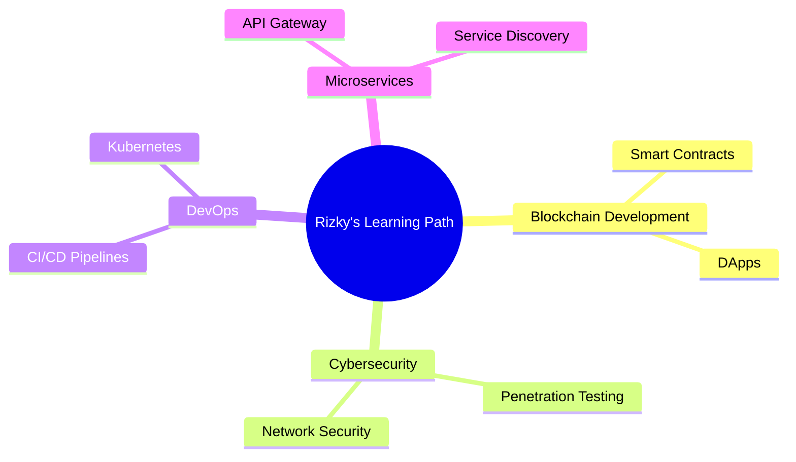

<!-- Header Banner -->

  

<!-- Introduction & Views -->

  
  
  

  

<!-- About Me Section -->

  <h2> <b>About Me</b></h2>

  <table border="0">
    <tr>
      <td>🎓</td>
      <td><b>Education:</b> Semester 6 Informatics Student at Universitas Syiah Kuala (USK), Aceh</td>
    </tr>
    <tr>
      <td>💡</td>
      <td><b>Passions:</b> Software Development, Machine Learning, Web Development, Mobile Apps</td>
    </tr>
    <tr>
      <td>✨</td>
      <td><b>Motto:</b> "Turning caffeine into code since 2019"</td>
    </tr>
    <tr>
      <td>🎯</td>
      <td><b>Goal:</b> Creating technology that positively impacts Indonesian society</td>
    </tr>
    <tr>
      <td>🔍</td>
      <td><b>Fun Fact:</b> I debug code in my dreams 💭</td>
    </tr>
  </table>

  
  
  
  
  

<!-- Tech Stack Section -->

  <h2> <b>Tech Stack</b></h2>

<table align="center">
  <tr>
    <td align="center" width="96">
      
       JavaScript
    </td>
    <td align="center" width="96">
      
       Python
    </td>
    <td align="center" width="96">
      
       Java
    </td>
    <td align="center" width="96">
      
       TypeScript
    </td>
    <td align="center" width="96">
      
       C++
    </td>
    <td align="center" width="96">
      
       React
    </td>
  </tr>
  <tr>
    <td align="center" width="96">
      
       MySQL
    </td>
    <td align="center" width="96">
      
       AWS
    </td>
    <td align="center" width="96">
      
       GitHub
    </td>
    <td align="center" width="96">
      
       Docker
    </td>
    <td align="center" width="96">
      
       REST API
    </td>
    <td align="center" width="96">
      
       Nginx
    </td>
  </tr>
</table>

 

  
  
  
  
  
  
  
  
  
  

<!-- Featured Projects Section -->

  <h2> <b>Featured Projects</b></h2>

  
  
  
  

<!-- Stats & Streak Section -->

  <h2> <b>GitHub Stats</b></h2>

  
  

  
  

<!-- Current Focus Section -->

  <h2> <b>Current Focus</b></h2>

<!-- Achievements Section -->

  <h2> <b>Achievements</b></h2>

  <table>
    <tr>
      <td align="center">
        
         Finalist Hackathon Nasional 2023
      </td>
      <td align="center">
        
         Best Project Award - Informatics Exhibition USK 2022
      </td>
      <td align="center">
        
         3rd Place in National Programming Competition 2021
      </td>
      <td align="center">
        
         Google Developer Student Club Member
      </td>
    </tr>
  </table>

<!-- Coding Activity Section -->

  <h2> <b>Coding Activity</b></h2>

  

<!-- Quote Section -->

  <h2> <b>Favorite Quote</b></h2>

  

<!-- Footer Section -->

  

<!-- Snake Animation -->

  

